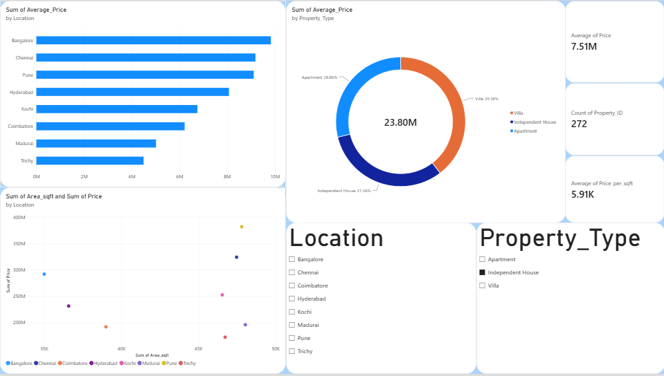

# Real Estate Price & Property Market Analytics

## Objective
The primary objective of this project is to analyze property prices across various Indian cities and build a Machine Learning model to answer the core business question: **"What is the expected market price of a property?"**

## Dataset Overview
The dataset contains 1,000 property records with the following key features:
- Property location 
- Area (sq. ft.)
- Bedrooms 
- Bathrooms 
- Age 
- Amenities (Gym, Parking, Swimming Pool, Security)
- Price 
- Property type (Apartment, Villa, Independent House)

## Project Phases

### 1. Excel Analysis
- **Price Analysis:** Base exploration of dataset features and pricing.
- **Location Comparison:** Summarizing pricing tiers across major cities.
- **Property Segmentation:** Breaking down value by property types.

### 2. SQL Analysis (`sql_analysis.sql`)
Aggregated data queries to extract actionable insights. The results of these queries have been exported as new sheets directly into the main `real_estate_dataset.xlsx` file.
- **Average price by location:** Identifies the most expensive markets (e.g., Bangalore, Chennai).
- **Property-type analysis:** Breaks down the value of Villas vs Apartments.
- **Price-per-square-foot analysis:** A granular look at value density.

### 3. Python & Machine Learning (`house_price_prediction.py`)
- **Exploratory Data Analysis (EDA):** Analyzed the target variable distribution and saved the visual to `price_distribution.png`.
- **Machine Learning Pipeline:** Implemented a Linear Regression model with automated preprocessing (OneHotEncoding for categorical variables, handling missing values).
- **Results:** The model successfully achieved an **R-squared accuracy of 0.9176**, demonstrating a very strong ability to predict real estate prices based on property features.
- **Model Output:** The trained pipeline is saved as `house_price_model.pkl` for immediate deployment and inference without needing to retrain.

### 4. Power BI Dashboard (`Real_Estate_Dashboard.pbix`)
The finalized dataset and SQL outputs were ingested into Power BI to create a fully interactive analytics dashboard.
- **Real-estate market dashboard:** Features dynamic visuals mapping price across cities, volume by property types, and a scatter plot revealing price-per-square-foot trends.
- **Key Performance Indicators (KPIs):** High-level summary metrics for stakeholders.
- **Interactivity:** Slicers implemented to allow drill-down analysis by Location and Property Type.

## Repository Contents
- `real_estate_dataset.xlsx`: The master dataset containing raw data and SQL output tabs.
- `sql_analysis.sql`: The SQL queries used for data aggregation.
- `house_price_prediction.py`: The Python script for EDA and ML training.
- `house_price_model.pkl`: The exported, trained Machine Learning model.
- `price_distribution.png`: Histogram visualization of property prices (EDA output).
- `Real_Estate_DashBoard.pbix`: The final interactive Power BI dashboard.
- `dashboard_screenshot.png`: A visual snapshot of the completed Power BI dashboard.
- `readme.md`: Project documentation and overview.